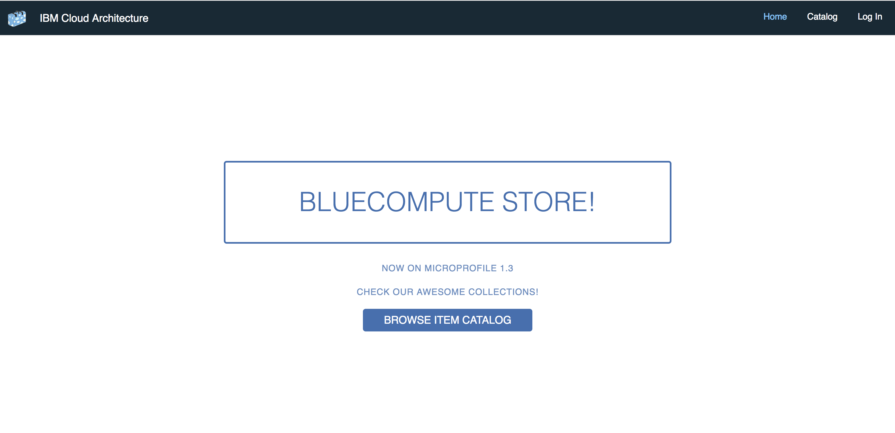

# BlueCompute Web Application

## Web Service

*This project is part of the 'IBM Cloud Native Reference Architecture' suite, available at
https://github.com/ibm-cloud-architecture/refarch-cloudnative-kubernetes*

- [Introduction](#introduction)
- [How it works](#how-it-works)
- [Implementation](#implementation)
- [References](#references)

## Introduction

The sample Web application is built to demonstrate how to access the Omnichannel APIs hosted on IBM Cloud . The application provides the basic function to allow user to browse the Catalog items, make an Order and check the profile. The Web application is built with AngularJS in Web 2.0 Single Page App style. It uses a Node.js backend to host the static content and implement the BFF (Backend for Frontend) pattern.

Here is an overview of the project's features:
- AngularJS SPA
- Node.js based BFF application to access APIs
- Authentication and Authorization.
- Distributed as Docker container and deployed to Kubernetes cluster.

## How it works

Web Microservice serves 'IBM Cloud Native Reference Architecture' suite, available at https://github.com/ibm-cloud-architecture/refarch-cloudnative-kubernetes, Microservice-based reference application. Though it is a part of a bigger application, Web service is itself an application that serves as User Interface for BlueCompute.

    

## Implementation

There are two versions of this application, each available in their own branch, as documented below.

- [Microprofile](../../tree/microprofile/) - Uses the backend microservices that are leveraged using Microprofile framework.
- [Spring](../../tree/spring/) - Uses the backend microservices that are leveraged using Spring Boot.

## References
1. [IBM Cloud Private](https://www.ibm.com/support/knowledgecenter/en/SSBS6K_2.1.0/kc_welcome_containers.html)
2. [IBM Cloud Private Installation](https://github.com/ibm-cloud-architecture/refarch-privatecloud)
3. [IBM Cloud Private version 2.1.0.2 Helm instructions](https://www.ibm.com/support/knowledgecenter/SSBS6K_2.1.0.2/app_center/create_helm_cli.html)
